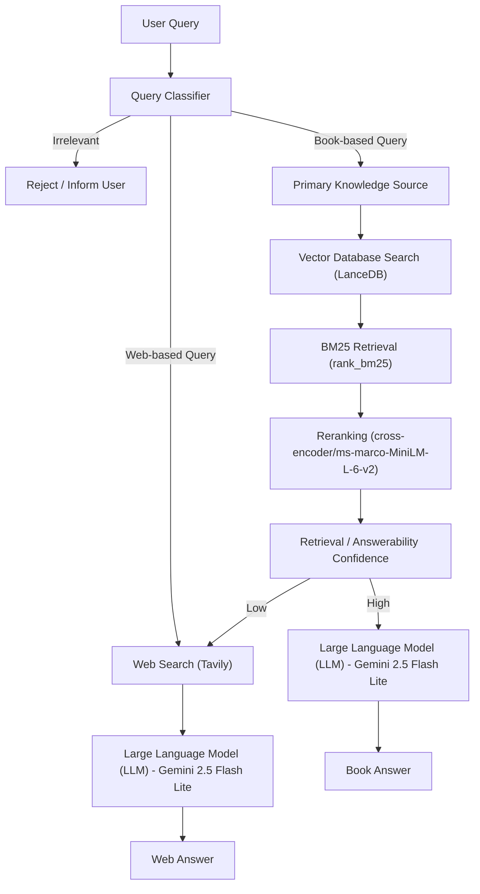

# Body Language Assistant

### *A research-driven interface for interpreting nonverbal behavior*

Body Language Assistant is an **Agentic Retrieval Augmented Generation (RAG)** system designed to interpret questions about **nonverbal communication** using grounded sources rather than generic artificial intelligence (AI) guesses.

The system retrieves knowledge from a **primary research source** and optionally supplements it with **web search**, providing context-aware explanations about body language cues.

Unlike general large language models (LLMs), this system first **classifies a user query**, determines the best information source, retrieves evidence, and then generates an answer.

---

# Project Overview

The Body Language Assistant combines:

* **Multimodal embeddings** for representing text and image information
* **Retrieval Augmented Generation (RAG)** for grounded answers
* **Query classification** to route questions to the appropriate knowledge source
* **Agentic orchestration** to dynamically decide how information should be retrieved

The system aims to encourage **responsible interpretation of body language**, emphasizing that nonverbal cues are **context-dependent and not definitive indicators of intent**.

---

# Architecture

## Query Processing Pipeline





---

# Query Classification

Each user query is classified into one of three categories:

| Category             | Description                                           |
| -------------------- | ----------------------------------------------------- |
| **Irrelevant Query** | Queries unrelated to body language or social behavior |
| **Book-based Query** | Questions answerable from the primary source          |
| **Web-based Query**  | Questions requiring broader or updated information    |

This classification ensures the system retrieves **the most relevant and trustworthy information source**.

---

# Knowledge Sources

## Primary Source

The primary knowledge base is derived from:

**The Definitive Book of Body Language**
By **Allan Pease & Barbara Pease**

PDF Source:

[https://e-edu.nbu.bg/pluginfile.php/331752/mod_resource/content/0/Allan_and_Barbara_Pease_-_Body_Language_The_Definitive_Book.pdf](https://e-edu.nbu.bg/pluginfile.php/331752/mod_resource/content/0/Allan_and_Barbara_Pease_-_Body_Language_The_Definitive_Book.pdf)

All credit for the original content belongs to the authors.

This project uses the text **only for research, indexing, and retrieval purposes** within a Retrieval Augmented Generation (RAG) pipeline.

No claim of ownership is made over the book's intellectual property.

---

## Secondary Source

When a query cannot be answered using the book, the assistant uses **web search** via:

**Tavily Search Application Programming Interface (API)**.

This allows the assistant to supplement answers with **recent or contextual information**.

---

# Technology Stack

| Component                      | Technology                           |
| ------------------------------ | ------------------------------------ |
| **Embedder**                   | openai/clip-vit-base-patch32         |
| **Large Language Model (LLM)** | Gemini 2.5 Flash Lite                |
| **Vector Database (DB)**       | LanceDB                              |
| **Application Framework**      | Streamlit                            |
| **Reranker**                   | cross-encoder/ms-marco-MiniLM-L-6-v2 |
| **Web Search**                 | Tavily                               |
| **Keyword Retrieval**          | rank_bm25                            |

---

# System Design

The project follows a **hybrid retrieval approach** combining:

1. **Vector similarity search**
2. **Keyword retrieval**
3. **Cross-encoder reranking**

This helps improve retrieval accuracy by balancing **semantic similarity and lexical relevance**.

---

# Use Cases

The Body Language Assistant can be used in:

### Education and Research

* Understanding nonverbal communication concepts
* Learning about posture, gestures, and facial cues
* Academic exploration of behavioral psychology

### Social Awareness

* Improving interpersonal communication
* Reflecting on social interactions
* Understanding contextual body language cues

### Training and Skill Development

* Interview training
* Negotiation awareness
* Public speaking preparation

### Behavioral Observation Support

* Assisting analysts or researchers studying human interaction patterns

---

# What This System DOES NOT DO

The Body Language Assistant **does not**:

* Detect lies or deception
* Predict a person's intentions
* Diagnose psychological conditions
* Replace trained behavioral experts
* Provide legal, medical, or psychological advice

Body language interpretations should **always be treated as contextual insights rather than definitive conclusions**.

---

# Ethical Considerations

This project emphasizes that:

* Nonverbal cues are **probabilistic, not deterministic**
* Cultural context strongly influences body language
* Observations must not be used for **discrimination, profiling, or judgment**

The assistant is designed as a **learning and reflection tool**, not a decision-making system.

---

# Installation and Setup

## Step 1 — Clone Repository

```bash
git clone <repository-url>
cd <repository-folder>
```

---

## Step 2 — Create Virtual Environment

Create a virtual environment and install dependencies.

```bash
python -m venv venv
source venv/bin/activate
pip install -r requirements.txt
```

---

## Step 3 — Navigate to Root Folder

Ensure you are in the project root directory before running any modules.

---

# Data Ingestion

Run the ingestion pipeline to index the primary knowledge source.

```bash
python -m ingestion.index_builder
```

This step:

* Processes the PDF
* Generates embeddings
* Stores vectors in **LanceDB**

---

# API Key Configuration

Create a `.env` file in the project root directory.

Example:

```
OPENROUTER_API_KEY=your_openrouter_api_key
TAVILY_API_KEY=your_tavily_api_key
```

Generate API keys from:

OpenRouter
[https://openrouter.ai/](https://openrouter.ai/)

Tavily
[https://tavily.com/](https://tavily.com/)

---

# Retrieval System

Run the retrieval orchestrator:

```bash
python -m retrieval.orchestrator
```

This module handles:

* Query classification
* Retrieval orchestration
* Reranking

---

# Launch the Application

Run the Streamlit application:

```bash
streamlit run app/app.py
```

The assistant will launch in your browser.

---

# Deployment (Streamlit Community Cloud)

Streamlit Live Application: [https://bodylanguageassistant-be8ifmzbu6kwnzxtazb64z.streamlit.app/](https://bodylanguageassistant-be8ifmzbu6kwnzxtazb64z.streamlit.app/)

To deploy:

1. Push the repository to GitHub
2. Go to:

[https://streamlit.io/cloud](https://streamlit.io/cloud)

3. Connect your GitHub repository
4. Set the entry point:

```
app/app.py
```

5. Add environment variables in Streamlit Cloud settings:

```
OPENROUTER_API_KEY = "your_openrouter_api_key"
TAVILY_API_KEY = "your_tavily_api_key"
```

---

# Tips for Using the Assistant

For best results:

* Ask **clear and descriptive questions**
* Provide **context for body language scenarios**
* Avoid asking the system to **judge individuals or predict intent**

Example good queries:

* *What does crossed arms usually indicate in a negotiation setting?*
* *What does a tight-lipped smile imply?*

---

# Acknowledgements

This project acknowledges the work of:

**Allan Pease and Barbara Pease**
Authors of *The Definitive Book of Body Language*

Their work forms the **primary knowledge base** used in this Retrieval Augmented Generation (RAG) system.

---

# Disclaimer

This project is intended **for educational and research purposes only**.

Interpretations generated by the assistant should **not be used for legal, psychological, hiring, or investigative decisions**.

---

# Fellowship Acknowledgement

This project was completed as part of **Outskill's Generative AI Engineering Fellowship Program (GenAI Engineering Fellowship)**, a hands-on program focused on building production-ready artificial intelligence (AI) systems and Retrieval Augmented Generation (RAG) applications.

More information about the fellowship can be found here:  
https://www.outskill.com/6-month-ai-engineering

---
